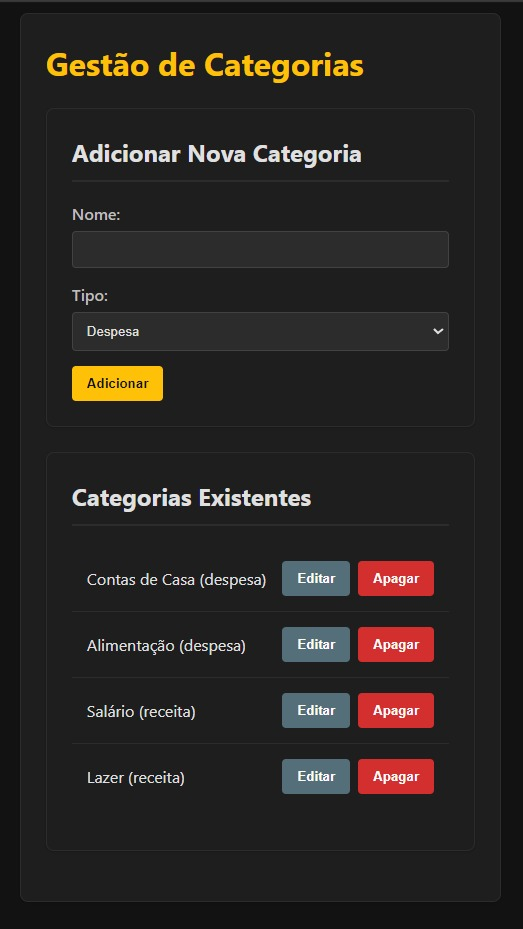
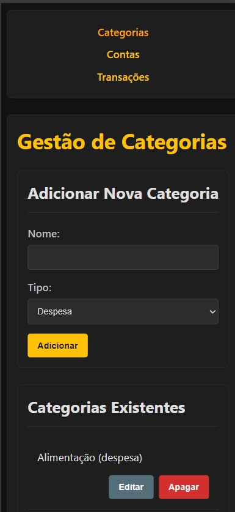
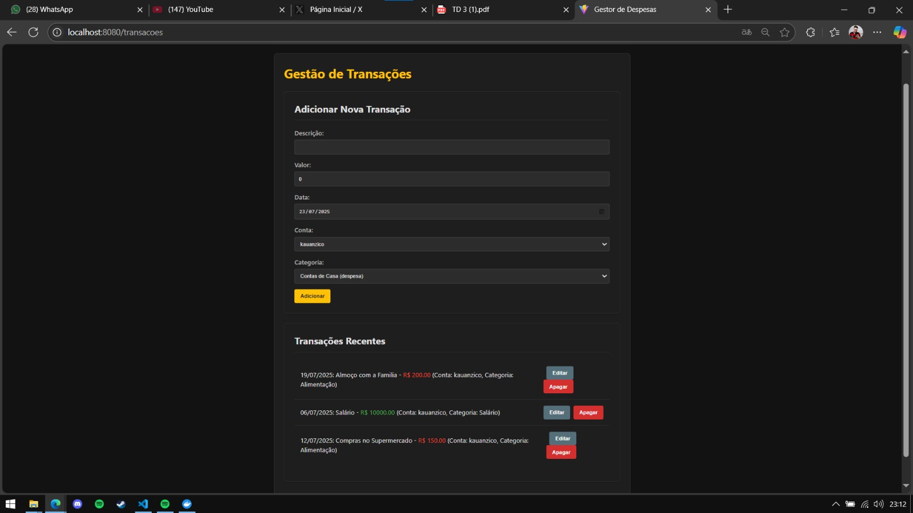
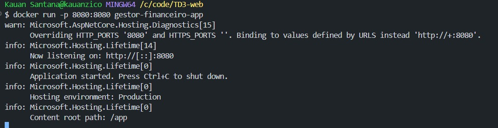

# Gestor Financeiro - Aplicação Full-Stack com .NET e React

Este projeto é referente ao Trabalho Dirigido 3 da disciplina de Desenvolvimento de Software para Web, com o objetivo de criar um Web Service em C# para persistir e manipular dados de uma Single Page Application (SPA) em React.

## 📝 Descrição do Projeto

A aplicação é um sistema de gestão financeira que permite ao usuário controlar suas finanças através do gerenciamento de Contas, Categorias e Transações.

O projeto é composto por:
* **Front-end:** Uma Single Page Application (SPA) desenvolvida com React e TypeScript.
* **Back-end:** Uma API Web construída com C# e .NET, seguindo os princípios SOLID.
* **Persistência de Dados:** Utilização de um banco de dados em memória do .NET para gerenciar os dados durante a execução da aplicação. 
* **Conteinerização:** Um `Dockerfile` que compila e executa a aplicação completa (front-end e back-end) em um contêiner Docker.

## ✨ Funcionalidades

* **CRUD completo** para as entidades de Categorias, Contas e Transações.
* API RESTful para comunicação entre o front-end e o back-end.
* Gerenciamento de estado centralizado no front-end para garantir consistência dos dados entre as páginas.

## 🚀 Tecnologias e Arquitetura

* **Front-end:** React, TypeScript, Vite, React Router
* **Back-end:** C#, .NET, ASP.NET Core Web API, Entity Framework Core (In-Memory)
* **Conteinerização:** Docker
* **Princípios de Arquitetura:** O projeto buscou aplicar os princípios **SOLID**, como a separação de responsabilidades nos controllers e o uso de DTOs (Data Transfer Objects) para a criação de entidades.

## ⚙️ Como Executar o Projeto com Docker

**Pré-requisitos:**
* Docker Desktop instalado e em execução.

**Instruções:**

1.  Clone este repositório para a sua máquina local.
2.  Abra um terminal na pasta raiz do projeto (onde o `Dockerfile` está localizado).
3.  Construa a imagem Docker com o seguinte comando:
    ```bash
    docker build -t gestor-financeiro-app .
    ```
4.  Após o build ser concluído, execute o contêiner:
    ```bash
    docker run -p 8080:8080 gestor-financeiro-app
    ```
5.  Abra o seu navegador e acesse `http://localhost:8080`. A aplicação completa estará rodando.

## 📸 Evidências de Funcionamento

Conforme solicitado, seguem abaixo as evidências da aplicação em funcionamento. 

**Página de Categorias**


**Gerenciamento de Contas**


**Página de Transações**


**Terminal com o Contêiner Docker em Execução**

